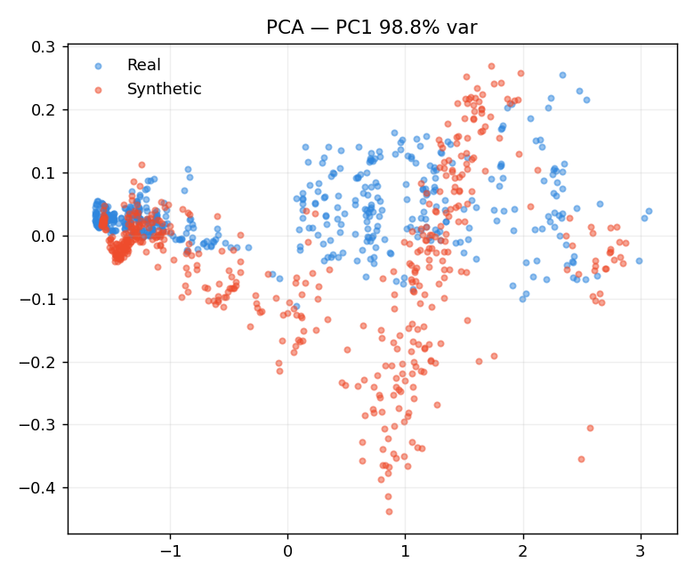
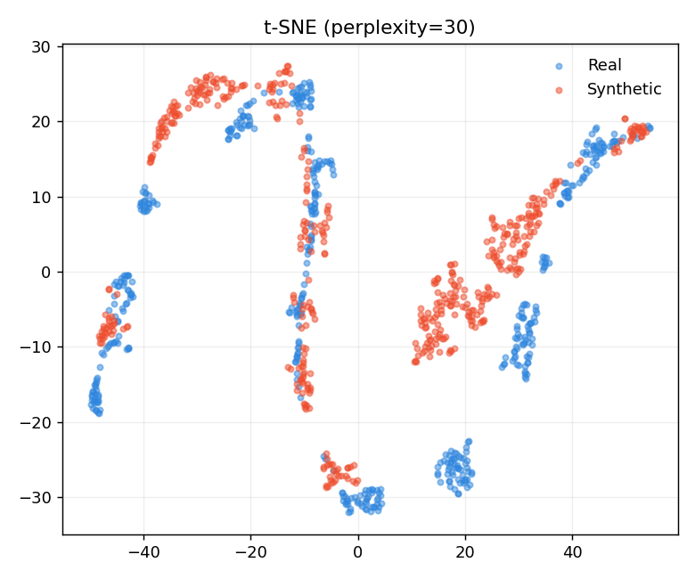

<div align="center">

# 📈 SyntheticMarket-GAN

**A WGAN-GP that generates synthetic AAPL price windows — with an honest account of where it works and where it doesn't.**

[](https://github.com/nicotimoneda/SyntheticMarket-GAN/actions/workflows/ci.yml)


</div>

---

## Summary

Backtesting a strategy on the same history used to build it overfits to one realised path. Synthetic price data is one remedy — but generating *realistic* financial series is hard. This project implements a **Wasserstein GAN with Gradient Penalty (WGAN-GP)** with unidirectional-LSTM generator and critic to produce 24-day AAPL price windows. The headline finding is honest: the model **avoids mode collapse and matches the marginal price distribution** (PCA/t-SNE overlap strongly), but its **day-to-day volatility is ~4× too high** — the metric that PCA and t-SNE silently miss.

## Results

Validation on 500 real vs. 500 synthetic windows (`models/generator_wgan.pth`, seed 42):

| Metric | Real | Synthetic | Notes |
|---|---:|---:|---|
| PCA — PC1 explained variance | — | **98.8%** | PC1 ≈ price level; clouds overlap |
| t-SNE (perplexity=30) | — | — | adjacent ridges, **no mode collapse** |
| Step-to-step std | **0.009** | **0.039** | the key failure |
| Ratio (synthetic / real) | 1× | **~4.3×** | synthetic paths too noisy |

<div align="center">


</div>

> PCA and t-SNE reduce each window to a single point, so they report good overlap while the *path* inside each window is wrong. The step-to-step std is what exposes it.

## Quick start

Requires [`uv`](https://github.com/astral-sh/uv).

```bash
uv sync                                              # install deps + package
python scripts/train.py                              # train (paper: 200 epochs, seed 42)
python scripts/evaluate.py --weights models/generator_wgan.pth   # figures + metrics.csv
```

The paper numbers above reproduce from the shipped weights with `scripts/evaluate.py`. Use `--epochs 2` for a fast smoke run of training.

## Stack

Python 3.11 · PyTorch · uv · pytest · ruff · GitHub Actions

## Repository structure

```text
SyntheticMarket-GAN/
├── src/syntheticmarket/
│   ├── data/loader.py            # yfinance + MinMax[0,1] + sliding window (24, step 1)
│   ├── models/generator.py       # 2-layer unidirectional LSTM → Linear → Sigmoid
│   ├── models/critic.py          # 2-layer unidirectional LSTM → Linear (scalar score)
│   ├── training/gradient_penalty.py
│   ├── training/trainer.py       # WGAN-GP loop (Adam β1=0, λ=10, n_critic=5)
│   └── evaluation/               # PCA + t-SNE, step-to-step metrics
├── scripts/train.py              # CLI: --epochs --seed --output-dir
├── scripts/evaluate.py           # CLI: --weights → figures + metrics.csv
├── notebooks/01_paper_reproduction.ipynb   # reproduces the blog-post plots
├── tests/                        # data / models / gradient penalty / metrics
├── models/generator_wgan.pth     # published baseline weights
└── .github/workflows/ci.yml      # ruff + pytest on Python 3.11
```

## Known limitations

The five fixable limitations reported in the blog post, verbatim:

1. **Single-feature input.** The model uses Close price only. Real financial dynamics include volume, the Open-High-Low spread, and volatility clustering. Adding log-returns (which are stationary and more amenable to modeling than raw prices) and volume would give the model access to the joint structure that drives realistic price paths.
2. **Validation is visual only.** PCA and t-SNE are useful but qualitative. Discriminative Score and Predictive Score from the TimeGAN paper, ACF comparison between real and synthetic returns, and TSTR (Train on Synthetic, Test on Real) are the standard quantitative benchmarks. These would convert "the plots look reasonable" into reproducible numbers.
3. **Critic design.** `h_n[-1]` is the strongest candidate for why temporal smoothness is not captured. The natural ablation is to replace the final-state pooling with mean pooling across all LSTM outputs, or to add a secondary loss term on step-to-step differences directly.
4. **MinMax scaler fitted on full dataset.** The scaler should be fit on the training split only. The current implementation leaks future price range information into the scaler bounds.
5. **No checkpointing.** Training is fixed at 200 epochs with no best-model saving. The reported model is the last-epoch model, not the epoch that minimized the Wasserstein estimate. Adding checkpointing based on the critic loss would almost certainly improve results.

## References & links

- I. Gulrajani, F. Ahmed, M. Arjovsky, V. Dumoulin, A. Courville. *Improved Training of Wasserstein GANs* (2017), NeurIPS 2017.
- 📝 Blog post (full write-up & validation): **[WGAN-GP on AAPL: when PCA looks fine but step-by-step volatility is 4× off](https://nicotimoneda.substack.com/p/wgan-gp-on-aapl-when-pca-looks-fine)**

## License

MIT — see [`LICENSE`](LICENSE).
