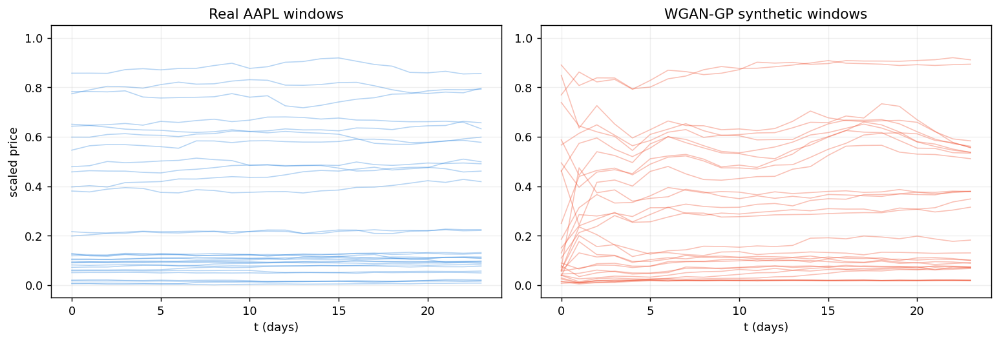
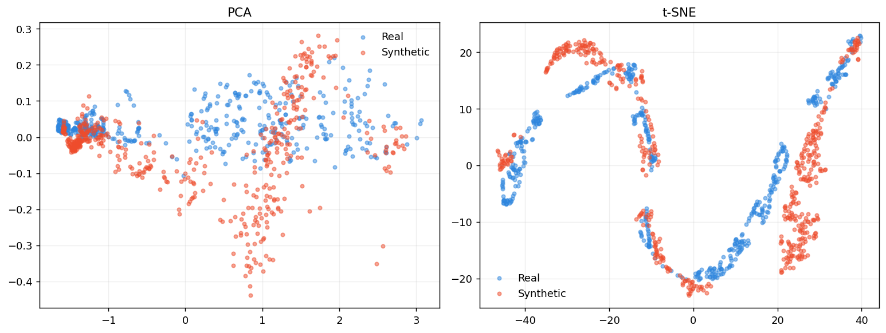
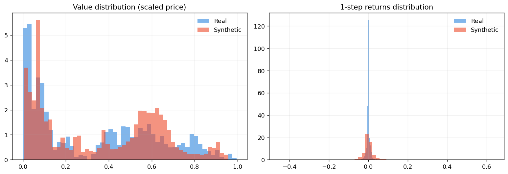

<div align="center">

# 📈 SyntheticMarket-GAN

**Synthesizing financial time series with a Wasserstein GAN (WGAN-GP).**

A study in generating realistic stock-price sequences — and in the part nobody puts on the slides: getting adversarial training to converge at all.


</div>

---

### What this is

A from-scratch implementation of a **Wasserstein GAN with Gradient Penalty (WGAN-GP)** that learns to generate synthetic daily price windows for a single equity (**AAPL**, 2015–2025).

The interesting problem isn't the generator — it's *stability*. Vanilla GANs on financial series collapse fast: the discriminator wins, gradients vanish, and the generator gives up. WGAN-GP swaps the discriminator for a **critic** that estimates the Wasserstein distance under a soft 1-Lipschitz constraint (the gradient penalty), which keeps gradients informative throughout training. This repo is the apparatus for studying that — a recurrent generator and critic, a reproducible data pipeline, and a distribution-level evaluation harness rather than a glance at the loss curve.

---

### 🧠 Architecture

Both networks are **stacked 2-layer LSTMs** (not bidirectional) so they model the temporal structure of a price window directly.

| Component | Input | Core | Output |
|-----------|-------|------|--------|
| **Generator** | noise `z ∈ (B, 24, 10)` | LSTM `hidden=64, layers=2, dropout=0.2` | `Linear → Sigmoid → (B, 24, 1)` in `[0,1]` |
| **Critic** | sequence `(B, 24, 1)` | LSTM `hidden=64, layers=2, dropout=0.2` | `Linear(last hidden) → (B, 1)` scalar score |

The generator ends in a **sigmoid** to match the `MinMax[0,1]` scaling of the data. The critic outputs a raw score — **no sigmoid** — because in the Wasserstein formulation it estimates a distance, not a probability. The 1-Lipschitz constraint is enforced softly via a gradient penalty on interpolations between real and generated samples:

```
L_critic = −( E[C(x_real)] − E[C(x_fake)] ) + λ · E[(‖∇ C(x̂)‖₂ − 1)²]
L_gen    = − E[C(x_fake)]
```

**Training setup**

| Hyperparameter | Value |
|----------------|-------|
| Sequence length | 24 days |
| Noise dimension | 10 |
| Batch size | 64 |
| Optimizer | Adam, `lr=1e-4`, `betas=(0.0, 0.9)` |
| Gradient-penalty λ | 10 |
| Critic steps per generator step | 5 |
| Epochs | 200 |

> `betas=(0.0, 0.9)` and the 5:1 critic-to-generator ratio are the canonical WGAN-GP settings — momentum on the first moment tends to destabilize the critic.

---

### 🔧 Data pipeline

```
yfinance ─▶ raw OHLCV CSV ─▶ select Close ─▶ MinMax[0,1] ─▶ sliding windows (len 24) ─▶ tensors
```

The pipeline is modular and reproducible: `data_loader.py` pulls history from Yahoo Finance, `preprocessing.py` scales and windows it, and `make_dataset.py` orchestrates the two and persists both the scaled series and the fitted scaler (so generated samples can be mapped back to price space).

---

### 📊 Results

Trained on AAPL daily closes (2015–2025), evaluated on **500 real vs. 500 generated** windows.

**Generated windows look like real ones** — same level structure and overall smoothness, with more variety in starting points:



**The populations overlap.** In PCA and t-SNE space the synthetic cloud sits on top of the real one rather than clustering off on its own — evidence the model learned the distribution instead of collapsing to a few modes:



**Marginals match closely; step-to-step dynamics are the harder part.** The value distribution overlaps almost exactly; the generator's one-step returns come out noisier than the real series — the model nails *where* prices sit better than the fine-grained day-to-day path:



| Statistic | Real | Synthetic |
|---|---:|---:|
| Mean (scaled) | 0.324 | 0.360 |
| Std (scaled) | 0.285 | 0.276 |
| 1-step return std | 0.009 | 0.039 |
| Lag-1 autocorrelation | 0.747 | 0.462 |

**Honest read:** the marginal distribution and overall structure are captured well (matching mean/std, strong PCA/t-SNE overlap); the temporal autocorrelation is only partially captured — synthetic windows are jaggier than real ones. Closing that gap is the headline item on the roadmap.

---

### 🚀 Quickstart

This project uses [**uv**](https://github.com/astral-sh/uv) for fast, reproducible environments.

```bash
# 1. Clone
git clone https://github.com/nicotimoneda/SyntheticMarket-GAN.git
cd SyntheticMarket-GAN

# 2. Create the environment from the lockfile
uv sync

# 3. Build the dataset (downloads + scales + windows AAPL)
uv run python src/make_dataset.py

# 4. Train and evaluate
uv run jupyter notebook notebooks/06_WGAN_GP.ipynb
```

The trained generator is saved to `models/generator_wgan.pth`.

---

### 📂 Project structure

```text
SyntheticMarket-GAN/
├── assets/                       # Figures used in this README
├── data/
│   ├── raw/                      # OHLCV pulled from Yahoo Finance
│   └── processed/                # MinMax-scaled series + fitted scaler
├── models/                       # Saved generator checkpoints (.pth)
├── notebooks/                    # End-to-end experimentation pipeline
│   ├── 01_Exploratory_Data_Analysis.ipynb
│   ├── 02_Model_Definition.ipynb
│   ├── 03_Training_Loop.ipynb
│   ├── 04_Evaluation_Metrics.ipynb
│   ├── 05_Improved_GAN.ipynb
│   └── 06_WGAN_GP.ipynb          # ⭐ Main notebook (WGAN-GP)
├── src/
│   ├── data_loader.py            # Yahoo Finance download
│   ├── preprocessing.py          # Scaling + sliding-window sequences
│   └── make_dataset.py           # Data pipeline orchestration
├── pyproject.toml                # Dependencies
└── uv.lock                       # Exact, reproducible lockfile
```

The numbered notebooks trace the full journey: EDA → a first vanilla GAN → diagnosing its instability → the WGAN-GP that fixed it.

---

### 🗺️ Roadmap

- [ ] Add a temporal-correlation / moment-matching loss term to close the autocorrelation gap
- [ ] Add quantitative fidelity metrics (e.g. discriminative & predictive scores à la TimeGAN)
- [ ] Generalize the pipeline to multivariate OHLCV and arbitrary tickers
- [ ] Package training as a CLI script alongside the notebooks

---

### 📝 License

MIT — see [`LICENSE`](LICENSE).

---

<div align="center">
  <sub>Built by Nicolás Timoneda · "The interesting part of a GAN is the part where it doesn't train."</sub>
</div>
